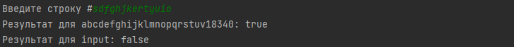

# Lab2_1
Написать регулярное выражение, определяющее является ли данная
строка строкой "abcdefghijklmnopqrstuv18340" или нет.
– пример правильных выражений: abcdefghijklmnopqrstuv18340.
– пример неправильных выражений: abcdefghijklmnoasdfasdpqrstuv18340

